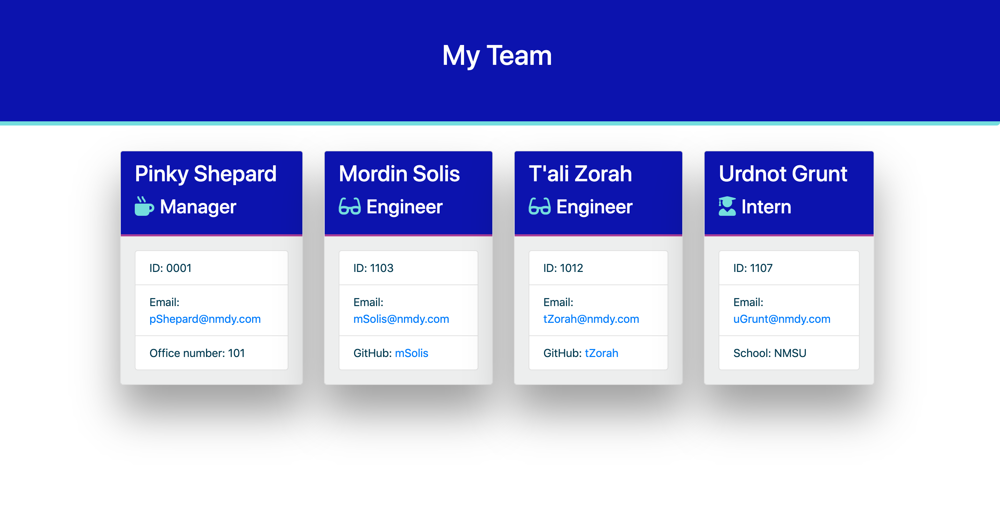

# TeamBUILDER

## Badges

 

## Description

A command-line application for creating a team HTML page.

Watch a demonstration of TeamBUILDER [here](https://drive.google.com/file/d/1FcZfSF_0xNTqJBtrAalv7HahyQwPi8Ur/view?usp=sharing)!

## Table of Contents

- [Installation](#Installation)
- [Usage](#Usage)
- [Credits](#Credits)
- [Contributing](#Contributing)
- [Test](#Tests)
- [Questions](#Questions)
- [License](#License)

## Installation

```bash

To install TeamBuilder, first clone the respository Github: git@github.com:jnel-221/TeamBUILDER.git, then:

* Open your terminal, or other tool used to access the command line, and navigate to the file where you want to save TeamBuilder.

* Run "git clone git@github.com:jnel-221/TeamBUILDER.git".

* Navigate to your newly cloned TeamBuilder folder.

* Run "NPM install", aka "npm i" to load the dependencies.

```

[Back to Table of Contents](#table-of-contents)

## Usage

Type 'node app.js' in command line to begin. Next, answer the series of questions about your team members to generate profiles. You can add as many as you like. When you're finished, answer 'no' when asked if you want to add a new employee. Your team page will then generate and populate in the output folder.

Screenshot of completed page:



[Back to Table of Contents](#table-of-contents)

## Credits

This app uses [node.js](https://nodejs.org/en/), [inquirer](https://www.npmjs.com/package/inquirer), HTML, CSS, and is powered by JavaScript. Design resources include: [Bootstrap](https://getbootstrap.com/), [FontAwesome](https://fontawesome.com/), and [coolers](https://coolors.co/). Unit tests powered by [jest](https://www.npmjs.com/package/jest).

[Back to Table of Contents](#table-of-contents)

## Contributing

Please review the community standards for contributing to this project, adopted from the [Contributor Covenant](https://www.contributor-covenant.org/).

[Back to Table of Contents](#table-of-contents)

## Tests

```bash
After installation, enter "npm run test" to run unit tests.

When all unit tests pass, you are ready to begin team building!
```

[Back to Table of Contents](#table-of-contents)

## Questions

Questions? You can reach me by email at jennifer.nelson242@gmail.com. Feel free to check out additional projects at [my GitHub profile](https://github.com/jnel-221).

[Back to Table of Contents](#table-of-contents)

## License

This project is licensed under the terms of the The Unlicense license.

[Back to Table of Contents](#table-of-contents)
